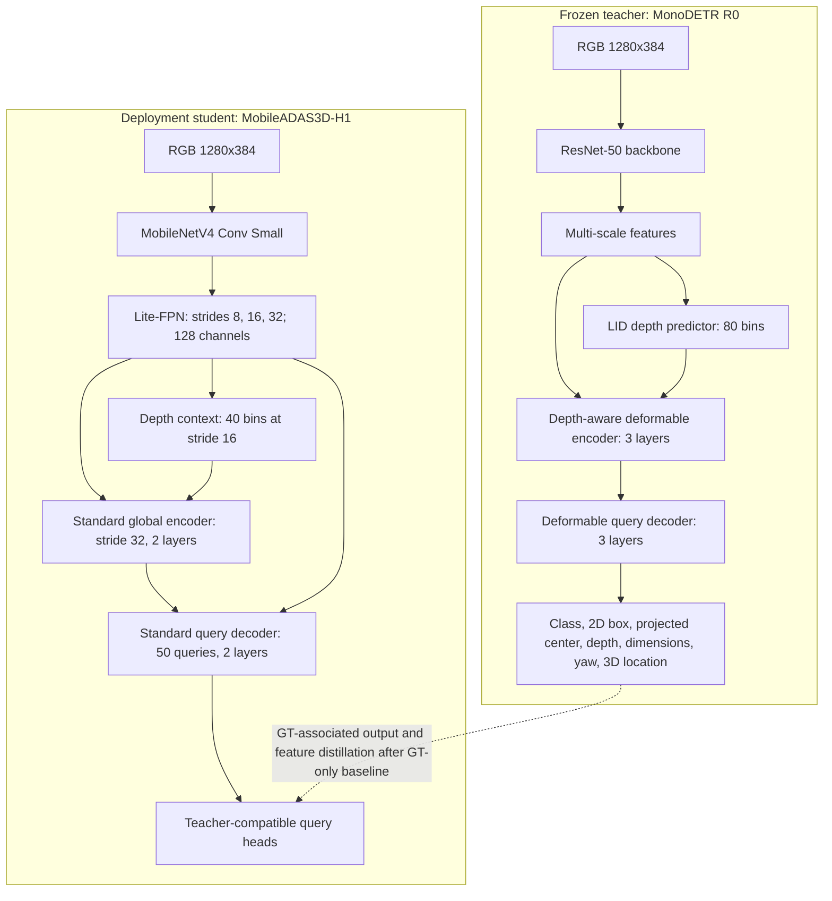

# MobileADAS3D-H1 hybrid student architecture contract

Status: random-graph edge preflight complete; GT-only training preparation next
Decision date: 2026-08-20

## Decision

MobileADAS3D-H1 is the next deployment candidate. It restores the teacher's
depth-aware, query-based reasoning while retaining a MobileNetV4 backbone and
using only fixed-shape Core ML operations. It replaces the accuracy-inadequate
dense S1 family; it does not modify or replace the frozen R0 teacher.

The S1 checkpoint sweep was deliberately waived when the project moved on:
S1-V1, invalid S1-V2, and corrected S1-V2b all missed the product gates by
orders of magnitude. S1 remains a documented speed baseline, not a training or
distillation candidate.

## Teacher and student side by side



## Locked H1 graph

```text
RGB Float32 /255 [1, 3, 384, 1280]
  -> embedded ImageNet normalization
  -> MobileNetV4 Conv Small ImageNet backbone
  -> native stride-8, stride-16, stride-32 features
  -> 1x1 projections + Lite-FPN, 128 channels
  -> stride-16 depth logits, 40 linearly increasing discretization bins
  -> expected-depth embedding added to multi-scale memory
  -> stride-32 tokens [1, 480, 192]
  -> 2 standard pre-norm Transformer encoder layers
  -> fixed multi-scale memory from strides 8/16/32
  -> 50 learned object queries, width 192
  -> 2 standard pre-norm Transformer decoder layers
  -> per-query product heads
```

Locked dimensions:

| Component | H1 value |
| --- | ---: |
| Input | 1280x384 |
| Backbone | MobileNetV4 Conv Small |
| FPN width | 128 |
| Transformer width | 192 |
| Attention heads | 6 |
| Encoder layers | 2 |
| Decoder layers | 2 |
| Feed-forward width | 768 |
| Object queries | 50 |
| Depth bins | 40 |
| Dropout | 0.0 for export determinism |

The encoder operates only on the 12x40 stride-32 map, limiting global
self-attention to 480 tokens. The decoder may cross-attend to fixed flattened
stride-8/16/32 memory so small Pedestrians retain high-resolution evidence.
All shapes are compile-time constants.

## Query output contract

Each of the 50 queries predicts:

| Output | Meaning |
| --- | --- |
| `class_logits` | Vehicle and Pedestrian sigmoid logits; unmatched queries are all-negative focal targets |
| `box2d_cxcywh` | normalized 2D box center, width, and height |
| `projected_center` | normalized projected 3D bottom center |
| `depth_logits` + `depth_residual` | depth distribution and local correction |
| `dimensions` | log residual from train-only class mean dimensions |
| `yaw` | direct sine/cosine vector, normalized only in loss/decoder |
| `location_xy` | X/Z and Y/Z auxiliary geometry ratios |
| `quality` | 3D localization quality used for ranking after calibration |

TopK, calibration back-projection, yaw normalization, score calibration, NMS,
tracking, and recording remain outside the Core ML graph.

## Teacher-to-student transfer map

H1 is structurally closer to R0, but it is not shape-identical. Exact R0 weight
loading is neither expected nor claimed.

| Teacher knowledge | H1 transfer method | Timing |
| --- | --- | --- |
| Image representation | ImageNet initialization, not R0 ResNet weights | initialization |
| Depth distribution | KL loss on GT-associated spatial depth distributions | after GT-only baseline |
| Query class/objectness scores | temperature-scaled query distillation after Hungarian association | after GT-only baseline |
| 2D box and projected center | GT remains primary; teacher is auxiliary on matched objects | after GT-only baseline |
| Depth, dimensions, location, yaw | confidence-gated regression distillation | after GT-only baseline |
| Transformer features | learned projection from R0 width 256 to H1 width 192, masked feature loss | optional ablation |

Ground truth remains authoritative. Teacher predictions never create unfiltered
pseudo-labels. Distillation is disabled until a complete GT-only H1 baseline is
trained, evaluated, and frozen.

## Explicit exclusions

H1 contains no multi-scale deformable attention, custom CUDA/Core ML operation,
dynamic query count, dynamic input shape, ROIAlign, grid sampling, recurrent
state, or in-model NMS. It does not use the full ResNet-50 teacher graph or the
dense S1 output contract.

## Gates before training

The random-weight H1 graph must pass:

1. parameters <= 10 million;
2. compute <= 15 GMAC at 1280x384;
3. FP16 Core ML package <= 25 MB;
4. no custom or host-fallback operation;
5. PyTorch-to-Core-ML raw-output maximum absolute delta <= 0.002;
6. physical iPhone 16 Pro Max model-only p95 <= 35 ms after 5 warmups and 100
   timed predictions.

If H1 misses compute, package, or device latency, reduce transformer width from
192 to 128 before reducing query count, input resolution, or stride-8 memory.
Only one fallback change is permitted per versioned experiment.

## Random-graph implementation evidence

The locked H1 graph is implemented in `models/mobile_adas3d_h1.py` with an
explicit fixed-shape attention implementation. It does not depend on PyTorch's
dynamic multi-head-attention export path. Forward, tuple-export, finite-value,
and full-graph backward tests pass.

Measured on the random-weight graph at 1280x384:

| Check | Result | Gate |
| --- | ---: | --- |
| Parameters | 3,619,457 | Pass (<=10M) |
| Compute | 4.9068 GMAC | Pass (<=15) |
| FP16 package | 10.35 MB | Pass (<=25 MB) |
| Core ML custom operations | none | Pass |
| Trace maximum absolute delta | 0.0 | Pass |
| FP16 Core ML maximum raw delta | 0.001941 | Pass (<=0.002) |
| FP32 Core ML control delta | 0.0000361 | Pass as diagnosis only |
| FP32 package | 20.56 MB | Size passes; not the required FP16 artifact |

The initial default output-head initialization amplified meaningless random
FP16 feature noise and produced a `0.07133` delta. H1 now uses neutral query
heads: normally distributed weights with standard deviation `0.001` and zero
biases. This is a training initialization change, not an output clamp or
reduced-precision tolerance change. With the unchanged strict `0.002` gate,
the all-FP16 graph passes at `0.001941`. A trained checkpoint must receive its
own parity evaluation; the random-weight result cannot waive that later gate.

The physical iPhone gate also passed on an iPhone 16 Pro Max using
`cpuAndNeuralEngine`: 5 warmups followed by 100 predictions produced mean
`5.042 ms`, median `4.924 ms`, p95 `5.804 ms`, and maximum `7.137 ms`. The p95
is well below the frozen `35 ms` ceiling. Durable evidence is stored in
`artifacts/h1_edge_preflight_20260821.json`.

The first GT-only 20-epoch H1 run passed runtime stability but failed learning
quality with 0.00 AP_R40 and excessive background proposals. Distillation
remains disabled, and those weights are not eligible for export.

The supervised gate uses one-to-one Hungarian assignment between 50 queries
and valid KITTI objects. Matching costs combine class probability, normalized
2D-box L1, generalized IoU, and projected-center L1. The optimized losses are
sigmoid focal classification, box L1/GIoU, projected center, 40-bin log-depth
classification plus residual, log-dimension residual, continuous yaw cosine,
X/Z and Y/Z location ratios, and localization quality. Unmatched queries are
negative classification/quality targets. This v1 objective is retired.

H1-v2 does not change the model or exported output shapes. It appends a fixed
zero no-object logit only inside the loss and decoder, giving the existing two
class logits DETR-style softmax background supervision. Quality targets use
ordinary matched 2D IoU, with matched and unmatched quality losses normalized
separately and the unmatched term explicitly down-weighted. The query decoder
reconstructs KITTI boxes and camera-frame 3D geometry for the frozen product
AP_R40 evaluator.

## Training order

1. Implement and unit-test the fixed-shape random graph.
2. Convert to Core ML and pass local raw-output parity.
3. Run the physical-iPhone random graph gate.
4. Run a 16-image H1-v2 memorization gate with Hungarian matching.
5. Require matched-score median >=0.50, unmatched-score p95 <=0.10, matched
   2D IoU mean >=0.70, and mean predicted-count error <=1 object/image.
6. Prepare a fresh full GT-only run only if the tiny gate passes.
7. Review complete Vehicle/Pedestrian AP_R40 and geometry diagnostics.
8. Continue GT-only training only if both classes learn and AP is materially
   above the S1 baseline.
9. Freeze the GT-only checkpoint and then run one paired R0-distillation
   experiment from the identical initialization.

The frozen product gates, data splits, class mapping, external nuScenes test,
Core ML parity, and sustained iPhone qualification remain unchanged.
